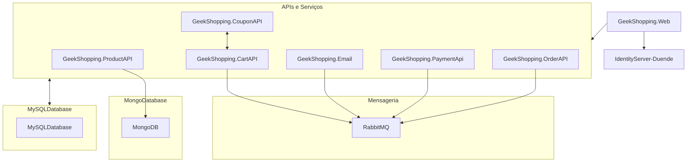

# GeekShopping Web - Loja virtual em .Net

 
Este projeto é originalmente desenvolvido no curso: # [Arquitetura de Microsserviços do 0 com ASP.NET, .NET 6 e C#](https://www.udemy.com/course/microservices-do-0-a-gcp-com-dot-net-6-kubernetes-e-docker)
O curso é muito interessante, mas o projeto em si não teve a profundidade que eu procurava, portanto, decidi por conta iniciar uma série de evoluções no projeto afim de torná-lo o que eu buscava aprender. Não que isto seja um demérito ao curso, porém, estou encarando isto como uma oportunidade para o aperfeiçoamento pessoal.
O sistema conta com as seguintes tecnologias (já contando com melhorias particulares):

 - Duende Identity -> Servidor de autenticação Auth2;
 - .Net Core 6 -> API's;
 - RabbitMQ -> Menssageria;
 - Ocelot -> Api Gateway;
 - MySql -> Armazenamento de dados;
 - MongoDB -> Armazenamento de imagens;

## Releases planejadas...
 - Integração com whatsApp;
 - Compartilhamento de produto em redes sociais;
 - Validação de cartão de crédito;
 - Envio de e-mail;
 - Infraestrutura com docker-compose;
 - TDD XUnit;
 - Etc..

## Arquitetura

## Suporte
Para suporte, mande um email para claudiovieira_jr@hotmail.com ou entre em nosso canal do Slack.
