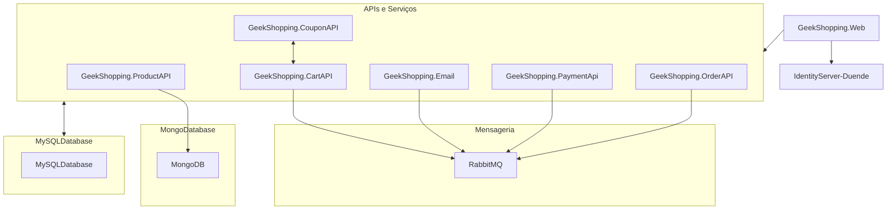

# GeekShopping Web - Loja virtual em .Net

 
Este projeto é originalmente desenvolvido no curso: # [Arquitetura de Microsserviços do 0 com ASP.NET, .NET 6 e C#](https://www.udemy.com/course/microservices-do-0-a-gcp-com-dot-net-6-kubernetes-e-docker)
O curso é muito interessante, mas o projeto em si não teve a profundidade que eu procurava, portanto, decidi por conta iniciar uma série de evoluções no projeto afim de torná-lo o que eu buscava aprender. Não que isto seja um demérito ao curso, porém, estou encarando isto como uma oportunidade para o aperfeiçoamento pessoal.
O sistema conta com as seguintes tecnologias (já contando com melhorias particulares):

 - Duende Identity -> Servidor de autenticação Auth2;
 - .Net Core 6 -> API's;
 - RabbitMQ -> Menssageria;
 - Ocelot -> Api Gateway;
 - MySql -> Armazenamento de dados;
 - MongoDB -> Armazenamento de imagens;

## Releases planejadas...
 - ~~Alterar cadastro de produtos: Ao invés de cadastrar url de imagens, armazená-las no mongoDb;~~ Completo
 - ~~Alterar cadastro de produtos: Cadastrar mais de uma imagem para o mesmo produto;~~ Completo
 - ~~Alterar cadastro de produtos: Carregar imagens como ícones no momento do cadastro;~~ Completo
 - ~~HomePage: Incluir 'Carousel' para que as imagens possam ser paginadas na home;~~ Completo
 - Integração com whatsApp;
 - Compartilhamento de produto em redes sociais;
 - ~~Validação de cartão de crédito~~;
    - ~~Inclusão da bandeira de cartão de crédito utilizado - Awsome fonts.~~
    - Layout adaptativo para outros métodos de pagamento.
 - Envio de e-mail;
 - Infraestrutura com docker-compose;
    -  Criação de Projeto específico para manter a infraestrutura: GeekShopping.Infraestructure
        1. ~~MongoDB;~~ Completo
        2. ~~mysql:8.0;~~ Completo
        3. ~~rabbitmq:3;~~ Completo
        4. API's;
        5. FrontEnd (AspNet);
 - TDD XUnit;
 - Etc..

## Arquitetura

## Tutorial
Para executar o projeto é muito simples, basta executar a seguinte sequência:
- GeekShopping.Infrastructure
    - O projeto Infrastructure vai cediar tudo que se relaciona a sustenção de ambientes.
    - Ao executá-lo, deve ser criado os bancos de dados e o serviço de RabbitMQ.
- Após isto, pode verificar se na solution, na opção "Configurar projetos de inicialização", estão sinalizados para iniciar os seguintes projetos:
    - GeekShopping.ApiGateway 
	- GeekShopping.CartApi
	- GeekShopping.CouponApi
	- GeekShopping.Email
	- GeekShopping.IdentityServer
	- GeekShopping.Infrastructure
	- GeekShopping.OrderAPI
	- GeekShopping.PaymentAPI
	- GeekShopping.Product
	- geekshopping.Web
- Nota: Os projetos GeekShopping.MessageBus e GeekShopping.PaymentProcessor não devem ser iniciados automaticamente.
- Após isto, o projeto deve carregar todas as API's através do swagger e o frontend no endereço: https://localhost:4430

## Novidades:
- Atualização 18/09
    - O checkout já conta com uma validação de cartão de crédito tanto no front-end como no back-end;
    - Agora, ao digitar o número do cartão, a aplicação identifica em tempo real (javascript) a bandeira do cartão;
    - Estamos evoluindo para um layout adaptativo dos pagamentos, então será mais simples de adicionar outras features de pagamento como boletos, pix ou... Bitcoin?!
 

## Suporte
Para suporte, mande um email para claudiovieira_jr@hotmail.com ou entre em nosso canal do Slack.

## Local de partida
Como informado, este projeto iniciou-se com o curso da Erudio, o cara realmente é fera e vale muito participar do treinamento. Caso queira comparar o projeto inicial e o meu projeto atual, segue o link:

- Git do projeto original: https://github.com/leandrocgsi/erudio-microservices-dotnet6
- Cursos da  empresa: https://pub.erudio.com.br/meus-cursos
